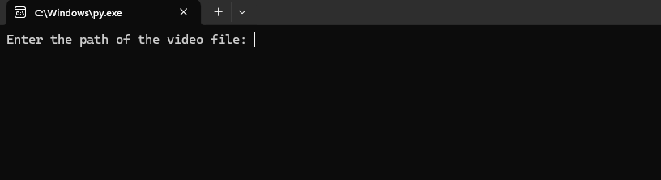
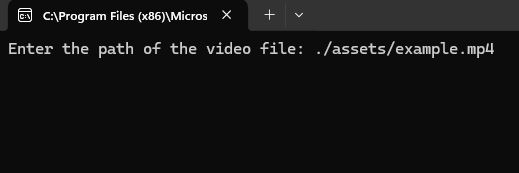
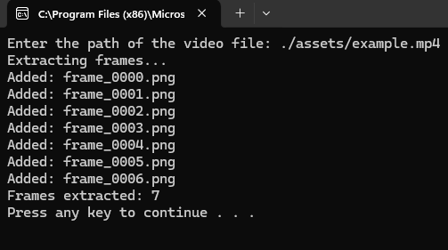
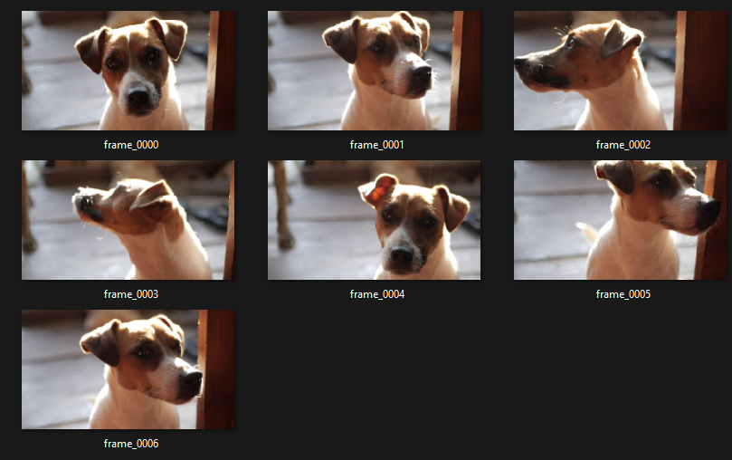

# Extract-Video-Frames
ExtractVideoFrames is a simple Python application designed to extract frames from a video file based on its FPS and save them as PNG images.

## Features
- Extracts frames from a video file based on its FPS.
- Saves extracted frames as PNG images in an `extracted_frames` folder.

## Usage
1. Run the `ExtractVideoFrames.py` script.
2. When prompted, enter the path of the video file you want to extract frames from.
3. The extracted frames will be saved in the `extracted_frames` folder within the directory where the script is located.

### Example Video:
https://github.com/woodsj1206/Extract-Video-Frames/assets/47829885/7ec846d7-1ee1-4fe2-acb7-f3f469b180b9

### Inputting a Video
| Input Prompt        | Input Example Video           |
| ------------- |:-------------:|
|  |  |

### Output
| Console Output       | Image Output           |
| ------------- |:-------------:|
|  |  | 

## Development Environment
- IDE: Microsoft Visual Studio Community 2022 
- Language: Python 3.9
